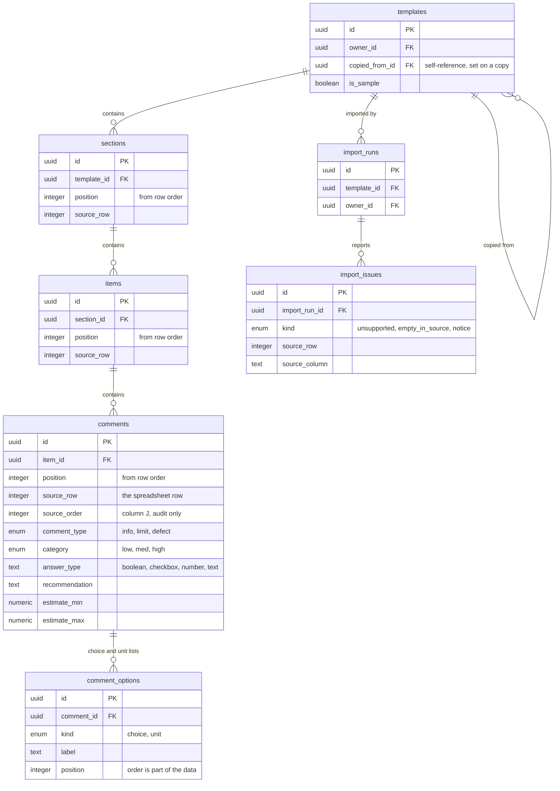

# Template Importer

Imports a Spectora template export into a structured schema, then lets you
review, edit and copy it. The import path is a deterministic parser — no LLM —
so every row in the database traces back to a cell in the source spreadsheet.

**Live:** https://hive-template-import.vercel.app

Reviewer credentials are in the submission email, not in this repo. Public
sign-ups are disabled, so those accounts are the only way in.

## What "Spectora HTML Text" actually is

Spectora's **Export to spreadsheet → Export HTML Text** produces a **spreadsheet
whose comment cells contain HTML** — not an HTML document. It ships named
`.xls`, but the bytes are XLSX.

The importer therefore identifies files by reading them, never by their
extension. The committed sample keeps its misleading name on purpose, as the
fixture that holds that behaviour in place.

## Stack

- Next.js (App Router) + TypeScript, deployed on Vercel
- Supabase (Postgres + Auth), row-level security on every table
- SheetJS for the workbook, cheerio for the comment HTML
- Vitest for the parser and the live isolation tests
- Playwright for the screenshots

## Getting started

```bash
pnpm install
cp .env.example .env.local   # fill in your Supabase project values
pnpm dev                     # http://localhost:3000
```

## Database setup

Migrations live in `supabase/migrations/` and run in order: schema, RLS, then
the deep-copy function.

```bash
pnpm dlx supabase link --project-ref <your-project-ref>
pnpm dlx supabase db push        # applies all three migrations
pnpm seed                        # creates the reviewer accounts and their samples
```

`pnpm seed` **runs the real parser** on the committed export
(`samples/spectora/internachi-residential-2026-09-20.xls`) once per reviewer
account — it does not restore a SQL dump. Seeding therefore exercises the
importer every time, and the app opens on genuinely imported content. Re-running
it replaces only each account's sample and leaves anything they imported or
copied alone.

Auth settings (sign-ups disabled, site URL, password policy) are declared in
`supabase/config.toml` and applied with:

```bash
pnpm dlx supabase config diff    # review first — see NOTES.md
pnpm dlx supabase config push
```

## Data model



The template is stored as rows rather than as a JSON blob because almost
everything the app does is a query against its parts — counting comments per
section, finding the twelve rows with no text, reordering one item among its
siblings, or deep-copying a whole tree in one transaction. A blob would make
each of those a read-modify-write of the entire template, and would put
row-level security at the template level instead of on the data itself.

Order is explicit, not implied. Each `position` is a dense integer assigned from
the order the rows appeared in the spreadsheet, and `(parent, position)` is
unique, so a tree read back in `position` order is the tree the export
described. The file's own `Order (w/i item)` column is kept as `source_order`
for the audit trail but never used for sorting, because 38 of 69 items carry
duplicate values in it.

Every comment records the `source_row` it came from, and every issue records its
row and column. That is what makes the import auditable: any row in this
database can be pointed back at one cell in the original spreadsheet, which is
stored with its import run so the two can still be compared later.

## Environment

`.env.example` lists every variable. Two notes:

- **API keys.** `NEXT_PUBLIC_SUPABASE_PUBLISHABLE_KEY` (`sb_publishable_…`) is
  the browser key; row-level security is what protects the data.
  `SUPABASE_SECRET_KEY` is server-only and bypasses RLS, so it never reaches the
  client — verified by grepping the production build. These replace the
  deprecated `anon` / `service_role` JWTs, with one caveat recorded in
  `NOTES.md`.
- **Reviewer accounts.** Created by the seed script through the admin API. The
  credentials go in the submission email.

## Tests

```bash
pnpm test        # parser, sanitizer and file checks
pnpm typecheck
pnpm lint
```

The live isolation tests (RLS between reviewers, and copy independence) need
credentials and skip without them:

```bash
set -a && . ./.env.local && set +a && pnpm test
```

Regenerate the hand-made variant fixture with
`node ai/scripts/make-variant-fixture.mjs`, and re-inspect the export with
`node ai/scripts/inspect-export.mjs samples/spectora/internachi-residential-2026-09-20.xls`.

## Deploying

The project is linked to Vercel; `vercel deploy --prod` builds and deploys, and
`vercel alias set <deployment> hive-template-import.vercel.app` points the short
URL at it. The three Supabase variables must exist in the Vercel project for
production, preview and development. Vercel Authentication is off, so the URL
opens for anyone — the app's own Supabase login is the gate.

## Screenshots

`docs/screenshots/` holds every screen at desktop 1440 and mobile 390, in light
and dark. Regenerate against a running app:

```bash
set -a && . ./.env.local && set +a && node ai/scripts/screenshots.mjs https://hive-template-import.vercel.app
```

## Layout

| Path                | What lives there                                            |
| ------------------- | ----------------------------------------------------------- |
| `src/lib/import/`   | Format sniffing, the parser, the allowlist, persistence      |
| `src/lib/db/`       | Read queries for the list, editor and report                 |
| `src/app/(app)/`    | Template list, import flow, editor, import report            |
| `samples/spectora/` | The committed export and its `SOURCE.md`                     |
| `supabase/`         | `config.toml` and the three migrations                       |
| `tests/`            | Parser fixtures, sanitizer, file checks, live isolation      |
| `ai/`               | Prompts and scripts used to build this                       |
| `docs/`             | Screenshots and the Hive vs Binsr research                   |
